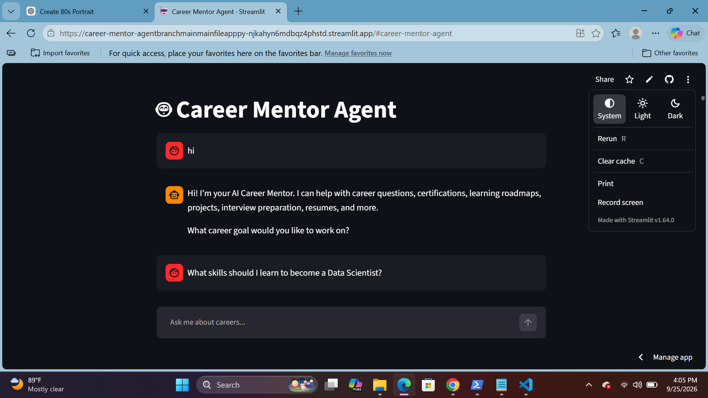
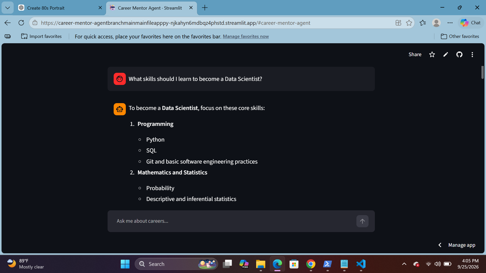

# 🤖 Career Mentor Agent

An AI-powered career guidance assistant built with **Python**, **Streamlit**, and the **GitHub Copilot SDK**.

Career Mentor Agent provides conversational career guidance to help users explore career paths, build personalized learning roadmaps, discover certifications and portfolio projects, and prepare for technical interviews.

---

## 🚀 Live Demo

👉 **[Try Career Mentor Agent](https://career-mentor-agentbranchmainmainfileapppy-njkahyn6mdbqz4phstd.streamlit.app/)**

---

## ✨ Features

* 💬 **Conversational Career Guidance**
* 🗺️ **Personalized Learning Roadmaps**
* 🎓 **Certification Recommendations**
* 💻 **Portfolio Project Ideas**
* 🎯 **Interview Preparation**
* 🧠 **AI-Powered Career Advice**
* 💾 **Session-Based Conversation History**
* 🌙 **Light & Dark Streamlit Themes**
* ⚡ **Fast Interactive Chat Interface**

---

## 🛠️ Technologies

| Technology                | Purpose                           |
| ------------------------- | --------------------------------- |
| 🐍 **Python**             | Application development           |
| 🎨 **Streamlit**          | Interactive web interface         |
| 🤖 **GitHub Copilot SDK** | AI agent integration              |
| 🧠 **GPT-5.4**            | AI-powered responses              |
| ⚡ **AsyncIO**             | Asynchronous programming          |
| 🔧 **Git & GitHub**       | Version control and collaboration |

---

## 🏗️ Architecture

```text
                         ┌────────────────────┐
                         │        User        │
                         └──────────┬─────────┘
                                    │
                                    ▼
                         ┌────────────────────┐
                         │     Streamlit      │
                         │      Chat UI       │
                         └──────────┬─────────┘
                                    │
                                    ▼
                         ┌────────────────────┐
                         │   Conversation     │
                         │      History       │
                         └──────────┬─────────┘
                                    │
                                    ▼
                         ┌────────────────────┐
                         │    System Prompt   │
                         │   Career Mentor    │
                         └──────────┬─────────┘
                                    │
                                    ▼
                         ┌────────────────────┐
                         │  GitHub Copilot    │
                         │       SDK          │
                         └──────────┬─────────┘
                                    │
                                    ▼
                         ┌────────────────────┐
                         │       GPT-5.4      │
                         └──────────┬─────────┘
                                    │
                                    ▼
                         ┌────────────────────┐
                         │  Career Guidance   │
                         │      Response      │
                         └────────────────────┘
```

---

## 📸 Application Preview

### 🏠 Career Mentor Interface



### 💬 AI Career Guidance



---

## 📁 Project Structure

```text
career-mentor-agent/
│
├── 📄 app.py
├── 📄 prompts.py
├── 📄 requirements.txt
├── 📄 README.md
├── 📄 .gitignore
│
└── 📁 screenshots/
    ├── 🖼️ career-mentor-home.png
    └── 🖼️ career-mentor-response.png
```

### 📄 Main Files

| File               | Description                  |
| ------------------ | ---------------------------- |
| `app.py`           | Main Streamlit application   |
| `prompts.py`       | Career Mentor system prompts |
| `requirements.txt` | Python dependencies          |
| `.gitignore`       | Files excluded from Git      |
| `screenshots/`     | Application screenshots      |

---

## 🤖 Agent Capabilities

Career Mentor Agent can assist users with:

### 🎯 Career Exploration

* Career path exploration
* Technology career comparison
* AI & Machine Learning career guidance
* Skill recommendations

### 📚 Learning & Development

* Skill development planning
* Personalized learning roadmaps
* Course recommendations
* Certification guidance

### 💻 Portfolio Development

* Portfolio project ideas
* Python project recommendations
* AI/ML project suggestions
* Project-based learning paths

### 🎤 Interview Preparation

* Technical interview preparation
* Data Science interview questions
* AI/ML interview preparation
* Internship preparation

---

## 💡 Example Questions

Try asking the Career Mentor Agent:

> **"What skills should I learn to become a Data Scientist?"**

> **"Create a 6-month roadmap for becoming a Machine Learning Engineer."**

> **"Which Python projects should I build for my portfolio?"**

> **"What certifications are useful for a beginner in AI and Machine Learning?"**

> **"How should I prepare for a Data Science internship interview?"**

---

## 🎓 Microsoft Frontier Program

This project was developed as part of the **Microsoft Frontier Program – Day 4 Agent-a-Thon**.

The project provided hands-on experience with:

* 🤖 AI Agent Development
* 🔗 GitHub Copilot SDK
* 🐍 Python Asynchronous Programming
* 🎨 Streamlit Application Development
* 🔐 Authentication & Secrets Management
* 🔧 Git & GitHub
* ☁️ Cloud Deployment

---

## ⚙️ Installation

### 1️⃣ Clone the Repository

```bash
git clone https://github.com/alimurtaza9dev-ctrl/career-mentor-agent.git
cd career-mentor-agent
```

### 2️⃣ Create a Virtual Environment

```bash
python -m venv .venv
```

### 3️⃣ Activate the Virtual Environment

**Windows:**

```bash
.venv\Scripts\activate
```

### 4️⃣ Install Dependencies

```bash
pip install -r requirements.txt
```

### 5️⃣ Run the Application

```bash
streamlit run app.py
```

The application will open automatically in your browser.

---

## 🔐 Configuration

The application uses **GitHub Copilot authentication**.

For local development, configure the required authentication credential according to the authentication method used by the application.

For cloud deployment, configure credentials through the deployment platform's **Secrets Management** system.

Example:

```text
COPILOT_GITHUB_TOKEN = "YOUR_TOKEN"
```

> ⚠️ **Never commit authentication tokens, API keys, passwords, or other sensitive credentials to GitHub.**

---

## 🌐 Deployment

The application is deployed using **Streamlit Community Cloud**.

### Deployment Flow

```text
GitHub Repository
       │
       ▼
Streamlit Community Cloud
       │
       ▼
Python Dependencies
       │
       ▼
Secure Secrets
       │
       ▼
Live Career Mentor Agent
```

The deployment uses:

* 📦 GitHub repository
* ☁️ Streamlit Community Cloud
* 🐍 Python dependencies
* 🔐 Streamlit Secrets
* 🤖 GitHub Copilot authentication

---

## 🔮 Future Improvements

Planned or potential improvements include:

* 📄 **Resume Analysis**
* 💼 **Job Recommendation System**
* 📊 **Personalized Skill-Gap Analysis**
* 🎤 **Mock Interview Sessions**
* 📈 **Career Progress Tracking**
* 🎯 **Specialized Career Paths**
* 🔗 **Job Platform Integration**
* 👤 **Personalized User Profiles**
* 📚 **Learning Resource Recommendations**

---

## 📚 Learning Outcomes

Building this project provided practical experience with:

### 🤖 Artificial Intelligence

* Building AI-powered applications
* Integrating AI models into Python applications
* Designing system prompts
* Developing conversational AI agents

### 🐍 Python

* Asynchronous programming with `asyncio`
* Application architecture
* Dependency management
* Environment configuration

### 🎨 Application Development

* Building interactive Streamlit interfaces
* Managing conversation state
* Creating chat-based applications

### 🔧 Development & Deployment

* Git and GitHub
* Authentication and secrets management
* Cloud deployment
* Project documentation

---

## 👨‍💻 Author

### Ali Murtaza

**Computer Science Student | AI & Data Science Enthusiast**

🔗 **GitHub:** [@alimurtaza9dev-ctrl](https://github.com/alimurtaza9dev-ctrl)

---

## 🙏 Acknowledgment

Developed as part of the **Microsoft Frontier Program – Day 4 Agent-a-Thon**.

Special thanks to the program for providing hands-on experience in AI agent development, GitHub Copilot SDK, Python, Streamlit, and cloud deployment.

---

## ⭐ Support

If you find this project useful, consider giving the repository a ⭐ **star** on GitHub!

---

<p align="center">
  Built with ❤️ using Python, Streamlit & GitHub Copilot SDK
</p>
